# Einstieg in die Verarbeitung von Laserscanning-Daten in R #

## Überblick ##

In diesem Tutorial lernen Sie, wie Sie mittels Flugzeug erhobene Laserscanning-Daten in R mit dem Paket lidR laden, visualisieren und verarbeiten. Der Schwerpunkt liegt auf etablierten Verfahren zur Erstellung von Standardprodukten wie digitalen Geländemodellen, Kronenhöhenmodellen sowie Gittern mit LiDAR-Punktmetriken. Außerdem lernen Sie eine vergleichsweise einfache Methode kennen, um Einzelbäume aus einer LiDAR-Punktwolke eines bewaldeten Gebiets zu identifizieren. Die meisten Inhalte dieses Tutorials basieren auf der offiziellen Dokumentation des Pakets lidR, die hier zu finden ist:

[https://r-lidar.github.io/lidRbook/](https://r-lidar.github.io/lidRbook/)

Einige Inhalte wurden direkt von der Seite kopiert und übersetzt, während andere Teile um Informationen ergänzt wurden, die ich für relevant hielt. Allen, die sich für dieses Thema interessieren, empfehle ich dringend, den oben genannten Link genauer anzusehen und auch die zusätzlichen Übungen zu bearbeiten, die dort beschrieben werden und in diesem Tutorial nicht behandelt werden.

## Lernziele ##

Sie machen sich mit dem Paket lidR vertraut und erwerben Kenntnisse zur Verarbeitung luftgestützter Laserscanning-Daten in R. Nach Abschluss des Tutorials können Sie

- in .laz- oder .las-Dateien gespeicherte LiDAR-Daten laden und visualisieren
- die LiDAR-Punktwolke anhand von Attributen filtern
- eine LiDAR-Punktwolke in Bodenpunkte und andere Punkte (hier i.d.R. Vegetation) klassifizieren
- digitale Höhenmodelle berechnen (digitales Geländemodell / Kronenhöhenmodell)
- höhennormalisierte Punktwolken erstellen
- Baumspitzen aus einer Punktwolke extrahieren
- Punktwolkenmetriken berechnen

## Im Tutorial verwendeter Datensatz ##

Der im Tutorial verwendete Datensatz stammt aus einer luftgestützten Laserscanning-Erhebung, die im Sommer 2019 in Süddeutschland durchgeführt wurde. Der Datensatz wurde im Juli 2019 unter belaubten Bedingungen mit einem Laserscanner RIEGL VQ-780i aufgenommen, der auf einer Cessna C207 montiert war. Das Laserscanning wurde mit einer Strahldivergenz von 25 mm/rad, einer Pulswiederholrate von 1000 kHz und einer Scanfrequenz von 225 Linien pro Sekunde durchgeführt. Die Flughöhe betrug etwa 650 m über dem Boden, die Fluggeschwindigkeit ungefähr 51 m/s und die Streifenüberlappung 76 Prozent. Der daraus resultierende mittlere Punktabstand betrug 28 cm. Die Punktdichten in den Untersuchungsflächen lagen zwischen 136 und 164 Punkten/m². Die Pulsdichten lagen zwischen 70 und 78 Pulsen/m². Der Datensatz ist eine kleine Teilmenge der Punktwolke, die eine Fläche von ungefähr 130 x 130 m abdeckt und als .laz-Datei gespeichert ist. Für dieses Gebiet wurden im Gelände alle Bäume mit einem BHD > 5 cm erfasst und Brusthöhendurchmesser, Baumart sowie die Position des Baumes aufgenommen. Die entsprechenden Daten werden als Point-Shapefile bereitgestellt.

Die .laz-Datei und das Shapefile können als ZIP-Archiv hier heruntergeladen werden:

[https://drive.google.com/file/d/1BI_Sw0aLIcngmotZtKmEGkFEAiLu7G4N/view?usp=sharing](https://drive.google.com/file/d/1BI_Sw0aLIcngmotZtKmEGkFEAiLu7G4N/view?usp=sharing "Dataset for the Tutorial")

Bitte laden Sie die Datei herunter und kopieren Sie sie in einen Ordner, den Sie auf Ihrem Computer finden können. Z. B.: D:/Studium/Projekt_1/ALS/

Entpacken Sie anschließend die Daten in diesem Ordner.

## Überblick über das Paket lidR und Danksagungen

lidR ist ein R-Paket zur Verarbeitung und Visualisierung luftgestützter Laserscanning-Daten (ALS) mit einem Schwerpunkt auf Anwendungen in der Forstwirtschaft. Das Paket ist vollständig Open Source und in das Geoinformations-Ökosystem von R integriert (d. h. raster/terra/stars und sp/sf). Dieser Leitfaden wurde sowohl für Einsteiger im Bereich ALS als auch für erfahrene Experten in der Punktwolkenverarbeitung geschrieben.

Die Entwicklung des Pakets lidR zwischen 2015 und 2018 wurde durch die finanzielle Unterstützung des AWARE-Projekts NSERC CRDPJ 462973-14; Förderempfänger Prof. Nicholas C. Coops ermöglicht. Die Entwicklung des Pakets lidR zwischen 2018 und 2020 wurde durch die finanzielle Unterstützung des Ministère des Forêts, de la Faune et des Parcs of Québec ermöglicht.

## Erste Schritte

### 1. Punktwolkendaten in R laden

Sensoren für ALS mit diskreten Rückläufen erfassen eine Reihe von Daten. An erster Stelle stehen Positionsdaten in drei Dimensionen (X,Y,Z) – dies wird normalerweise als „Punktwolke“ bezeichnet. Die einfachsten Punktwolken enthalten nur Informationen über die X-, Y- und Z-Position und sonst nichts. Die meisten Laserscanning-Sensoren erfassen jedoch zusätzliche Informationen, beispielsweise die Intensität für jeden Punkt, die Position jedes Punktes in der Rücklaufsequenz (denken Sie an die im theoretischen Teil besprochenen „Multi-Return“-Fähigkeiten eines einzelnen Laserstrahls) oder den Einfallswinkel des Strahls für jeden Punkt. Aufgrund der häufig enormen Datenmengen, die während einer Laserscanning-Erhebung gesammelt werden, ist das Lesen, Schreiben und effiziente Speichern von Laserscanning-Daten ein kritischer Schritt vor jeder weiteren Analyse.

ALS-Daten werden am häufigsten im LAS-Format gespeichert, das speziell dafür entwickelt wurde, ALS-Daten standardisiert zu speichern. Das DAteiformat wird mittlerweile von der American Society for Photogrammetry & Remote Sensing (ASPRS) offiziell dokumentiert und gepflegt. LAS-Dateien benötigen jedoch viel Speicher, da sie nicht komprimiert sind. Das LAZ-Format hat sich als Standard für die Komprimierung etabliert, da es kostenlos und Open Source ist.

Die weite Verbreitung, Standardisierung und der Open-Source-Charakter der LAS- und LAZ-Formate haben die Entwicklung des Pakets lidR gefördert. Es wurde entwickelt, um LAS- und LAZ-Dateien sowohl als Eingabe als auch als Ausgabe zu verarbeiten und dabei über das Paket rlas die C++-Bibliotheken LASlib und LASzip zu nutzen.

Die Funktion readLAS() liest eine LAS- oder LAZ-Datei ein und gibt ein Objekt der Klasse LAS zurück. Die formale Klasse LAS ist in einer eigenen Vignette ausführlich dokumentiert. Kurz zusammengefasst besteht eine LAS-Datei aus zwei Teilen:

- Der Header, der zusammenfassende Informationen über den Inhalt speichert, einschließlich der Bounding Box der Datei, des Koordinatenreferenzsystems und des Punktformats.
- Die Nutzdaten, also die eigentliche Punktwolke.

Die Funktion readLAS() liest eine Datei ein und erstellt ein Objekt, das sowohl den Header als auch die Nutzdaten enthält. Wir beginnen nun mit dem praktischen Teil, indem wir den folgenden Code in R ausführen. Lesen Sie auch die Kommentare im Code sorgfältig. Zunächst laden wir alle benötigten Pakete. R gibt eine Warnmeldung aus, falls ein Paket noch nicht installiert ist. Falls dies der Fall ist, installieren Sie die Pakete entweder über das Hauptmenü von RStudio, indem Sie „Tools“ => „Install packages“ auswählen und anschließend dem erscheinenden Dialog folgen, oder indem Sie den entsprechenden R-Code zum Installieren der Pakete in die Konsole eingeben. Um beispielsweise das Paket „terra“ zu installieren, verwenden Sie den folgenden Code:

	install.packages("terra")

Für das lidR-Paket welches wir im folgenden hauptsächlich verwenden wäre es entsprechend:

	install.packages("lidR")

Aber jetzt laden wir die Pakete und den Datensatz
	
	############################
	## Loading LiDAR data to R
	############################
	
	
	# installing the lidR package (only required one time)
	# if the package is not installed yet

	
	# loading the lidR package
	require(lidR)
	require(stars)
	require(terra)
	require(sp)
	require(sf)
	require(ggplot2)
	require(gstat)
	
	# load the example dataset - a subset from an airborne
	# laserscanning survey conducted in 2020 in study site
	# near Karlsruhe in the South of Germany
	
	# load complete dataset (the path has to be adapted)
	las <- readLAS("D:/Studium/Projekt_1/ALS/BR01.laz")
	
Mit diesen Codezeilen sollten Sie nun die ALS-Daten geladen haben. Um sicherzustellen, dass die Daten korrekt geladen wurden, können wir Folgendes ausführen:

	# check summary of loaded dataset
	summary(las)

Dies sollte die folgenden Ausgaben liefern:

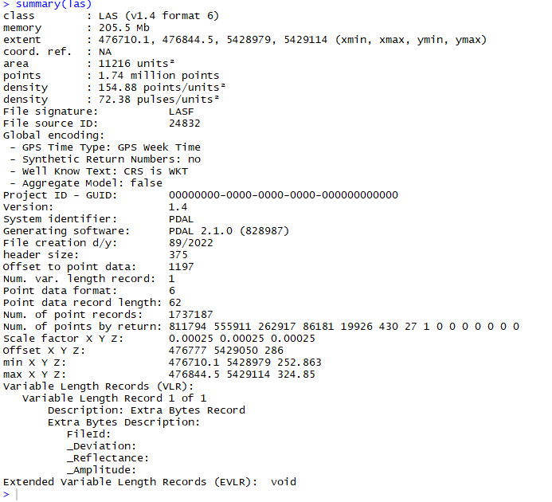

Wir sehen, dass eine ganze Menge Informationen angezeigt wird, aber wir werden nicht auf jedes Detail eingehen. Einige interessante Punkte sind beispielsweise, dass die Gesamtzahl der **Punkte** 1,74 Millionen beträgt und wir anhand der im Attribut **extent** angegebenen Koordinaten sehen können, dass die Fläche ungefähr 130 x 130 m groß ist. Außerdem sehen wir, dass der Datei derzeit kein **Koordinatenreferenzsystem** zugewiesen ist.

Durch die einfache Verwendung des Befehls readLAS() haben wir den vollständigen Datensatz in R geladen – dies ist in vielen Situationen eine gute Wahl. Wie wir jedoch am Attribut **memory** sehen können, haben wir dabei auch einen ziemlich großen Datensatz von 205,5 MB geladen (daher wurde die ursprüngliche Dateigröße der komprimierten LAZ-Datei um fast das Zehnfache erhöht, da die ursprüngliche LAZ-Datei ungefähr 23 MB groß ist).

In manchen Fällen möchten wir nicht den vollständigen Datensatz laden, sondern beispielsweise nur die Positionsdaten, während uns Informationen zur Intensität oder zum Scanwinkel nicht interessieren. Oder wir interessieren uns nur für eine bestimmte Art von Rückläufen, beispielsweise ausschließlich für Daten des „first return“ (also alle 3D-Punkte, die aufgezeichnet wurden, als der Laserstrahl zum ersten Mal mit einem Objekt interagierte, während nachfolgende Rückläufe nicht berücksichtigt werden sollen). In solchen Fällen bietet das Paket lidR Möglichkeiten, nur Teile des Datensatzes einzulesen, wie im folgenden Code beispielhaft gezeigt:

	# It is also possible to only load specific subsets of the data
	# by either using the "select" argument to only load certain columns
	# of the dataset (columns are attributes - such as x, y, z position,
	# scan angle, return number, etc.)
	# or by using the filter argument to only load certain rows (data points) of the
	# dataset - for the latter the options are listed here
	readLAS(filter = "-help")
	# load only 3D points and discard other information
	las_xyz <- readLAS("D:/00_FUB/3_lehre/2_Projekt_1/1_tree_attributes/Practicals/2_LiDAR/BR01.laz", select="xyz")
	# load complete dataset but only first returns
	las_fr <- readLAS("D:/00_FUB/3_lehre/2_Projekt_1/1_tree_attributes/Practicals/2_LiDAR/BR01.laz", "-keep_first")

**MINI-ÜBUNG:** Versuchen Sie, die obigen Zeilen auszuführen, und prüfen Sie mit dem bereits weiter oben kennengelernten Befehl **summary**, wie sich die Größe der geladenen Datensätze (Attribut **memory**) verändert hat.

Wie oben erwähnt, enthält ein typischer LiDAR-Datensatz nicht nur Informationen über die Punktpositionen, sondern auch zusätzliche Informationen. In den bisher geladenen Datensätzen können wir prüfen, welche zusätzlichen Daten gespeichert sind, indem wir Folgendes ausführen:

	names(las@data)

Dies führt zur folgenden Ausgabe:

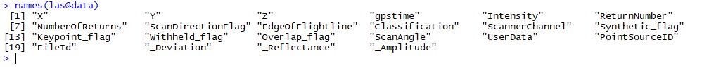

Wir sehen also, dass jeder LiDAR-Punkt nicht nur eine X-, Y- und Z-Koordinate besitzt, sondern viele zusätzliche Attribute, die während der Analyse verwendet werden können. Obwohl viele dieser Attribute normalerweise nicht zur Gewinnung von Informationen über die Zielvariable (z. B. Waldparameter) verwendet werden, bilden Intensity und ReturnNumber die einzigen Ausnahmen, da beide normalerweise relevante Informationen über das Objekt enthalten, mit dem der Laserstrahl interagiert hat.

### 2. LiDAR-Daten mit lidR visualisieren
	
Das Paket lidR nutzt das Paket rgl, um einen vielseitigen und interaktiven 3D-Viewer bereitzustellen, bei dem die Punkte standardmäßig anhand ihrer Z-Koordinaten auf schwarzem Hintergrund eingefärbt werden. Die einfachste Möglichkeit, eine Punktwolke darzustellen, ist die Funktion plot().

	plot(las)

Dies führt zum folgenden Plot:

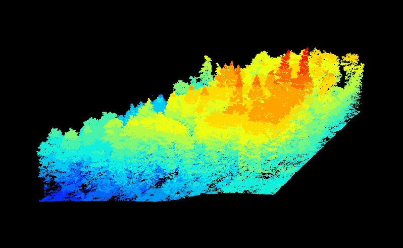

Beachten Sie, dass der Plot tatsächlich interaktiv und in 3D ist. Das heißt, durch Klicken und Gedrückthalten der Maustaste und anschließendes Bewegen der Maus können Sie den Plot drehen und verschieben. Mit dem Mausrad können Sie hinein- und herauszoomen. Probieren Sie dies ein wenig aus, bis Sie mit der Navigation im Plot vertraut sind.

Wie bei den meisten R-Plots ist es möglich, den Plot mit zahlreichen Einstellungen zu verfeinern und anzupassen. Hier sind zwei Beispiele. Im ersten Beispiel wird die Farbe der Punkte (die im ersten Plot anhand der Höhe der Punkte bestimmt wurde) auf Grundlage von ScanAngle festgelegt und im zweiten anhand der Intensity der LiDAR-Rückläufe. In beiden Fällen wird der Hintergrund auf Weiß gesetzt.
	
	# Plot las object by scan angle, 
	# make the background white, 
	# display XYZ axis and  scale colors
	plot(las, color = "ScanAngle", bg = "white", axis = TRUE, legend = TRUE)
	# use LiDAR intensity as color, use the break argument to improve color scale
	plot(las, color = "Intensity", breaks = "quantile", bg = "white")
	
Dies führt zu den folgenden beiden Plots:

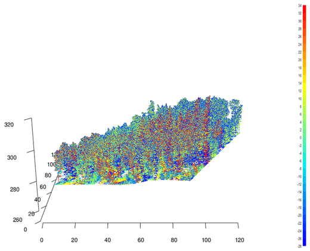
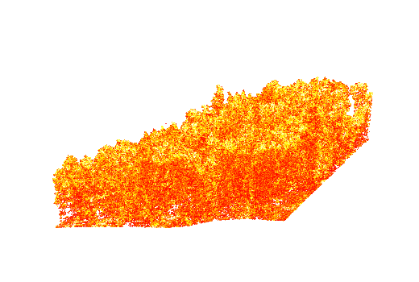

Wie Sie sehen können, zeigen die x- und y-Dimensionen nicht die tatsächlichen Koordinaten des Gebiets, sondern beginnen am Ursprung 0, 0. Die Höhen (z-Achse) zeigen dagegen tatsächlich ihre wahren Werte. In den aktuellen Plots handelt es sich dabei um Werte über dem Meeresspiegel. Obwohl diese Plots recht anschaulich sind, kann eine Transektsicht der Punktwolke in vielen Fällen effizienter sein, um die Details einer LiDAR-Punktwolke visuell zu untersuchen, insbesondere wenn der Datensatz einen Wald darstellt. Im Paket lidR ist es ebenfalls möglich, Transektsichten darzustellen, allerdings sind dafür mehrere Schritte erforderlich.

Zunächst müssen wir die Punktwolke so zuschneiden, dass nur ein schmaler Streifen (= das Transekt) übrig bleibt. Dafür gibt es eine eigene Funktion. Wir müssen den Startpunkt und den Endpunkt des Transekts sowie eine Breite (in Metern) festlegen. Dies können wir mit folgendem Code tun:
	
	# make transect plot
	# have a look at y and y coordinates to define start and end point
	# point coordinates have to lay between min and max of X and Y variables
	summary(las$X)
	summary(las$Y)
	
	# define some start and end point
	p1 <- c(476715, 5429035)
	p2 <- c(476758, 5429075)
	
	# clip transect
	las_tr <- clip_transect(las, p1, p2, width = 2, xz = TRUE)
	
Nun haben wir ein kleines Transekt aus unserem Plot ausgeschnitten und können es mit der Funktion **ggplot** visualisieren. Vielleicht kennen Sie ggplot bereits aus anderen Kursen, in denen Sie R verwendet haben. Es ist wahrscheinlich das bekannteste R-Paket zur Erstellung anspruchsvollerer Plots, und im Internet gibt es umfangreiche Literatur zu diesem Paket. Daher werde ich hier nicht auf die Details der Parameter eingehen. Sie können beispielsweise etwas mit dem Parameter für die Farbgebung der Punkte (Argument „color = Z“) sowie mit der Punktgröße (Argument „size = 0.5“) experimentieren.

	# plot transect
	ggplot(las_tr@data, aes(X,Z, color = Z)) + 
	  geom_point(size = 0.5) + 
	  coord_equal() + 
	  theme_minimal() +
	  scale_color_gradientn(colours = height.colors(50))
	

Dies führt zum folgenden Plot:

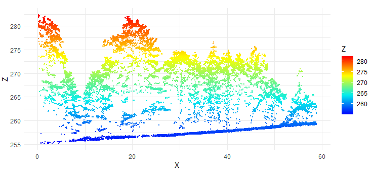

Da die Erstellung eines Transekt-Plots mehrere Schritte erfordert und wir möglicherweise später häufiger Transektsichten darstellen möchten, können wir eine benutzerdefinierte Funktion definieren, mit der wir eine Transektsicht unseres Datensatzes darstellen können. Ich werde nicht im Detail erklären, was die Funktion genau macht, aber wir werden sie in den folgenden Abschnitten einige Male verwenden. Führen Sie daher einfach den vollständigen Code unten in R aus; anschließend steht die Funktion in den nächsten Teilen des Tutorials zur Verfügung.

	# prepare function to make transect plotting more easy
	plot_crossection <- function(las,
	                             p1 = c(min(las@data$X), mean(las@data$Y)),
	                             p2 = c(max(las@data$X), mean(las@data$Y)),
	                             width = 4, colour_by = NULL)
	{
	  colour_by <- enquo(colour_by)
	  data_clip <- clip_transect(las, p1, p2, width)
	  p <- ggplot(data_clip@data, aes(X,Z)) + geom_point(size = 0.5) + coord_equal() + theme_minimal()
	  
	  if (!is.null(colour_by))
	    p <- p + aes(color = !!colour_by) + labs(color = "")
	  
	  return(p)
	}
	

### Klassifizierung von Bodenpunkten

Die Klassifizierung von Bodenpunkten ist ein wichtiger Schritt bei der Verarbeitung von Punktwolkendaten. Die Unterscheidung zwischen Boden- und Nicht-Bodenpunkten ermöglicht die Erstellung eines kontinuierlichen Modells der Geländehöhe, das häufig als „digitales Geländemodell“ (DTM) bezeichnet wird. DTMs sind für viele Anwendungen nützlich, beispielsweise zur Berechnung des Abflusses in hydrologischen Modellen, zur Bestimmung geeigneter Standorte für Windkraftanlagen oder zur Ableitung von Exposition und Hangneigung. In der Literatur wurden viele Algorithmen zur Klassifizierung von Bodenpunkten beschrieben, und lidR stellt derzeit zwei davon bereit: Progressive Morphological Filter (PMF) und Cloth Simulation Function (CSF), die mit der Funktion classify_ground() verwendet werden können. Das Paket lidRplugins stellt einen zusätzlichen Algorithmus namens Multiscale Curvature Classification (MCC) bereit.

Die Implementierung des PMF-Algorithmus in lidR basiert auf der von Zhang et al. (2003) beschriebenen Methode mit einigen technischen Anpassungen. Die ursprüngliche Methode ist rasterbasiert, während lidR punktbasierte morphologische Operationen durchführt, da lidR eine auf Punktwolken ausgerichtete Software ist. Die wichtigsten Schritte der Methoden sind in der folgenden Abbildung zusammengefasst (aus dem lidR-Buch übernommen).

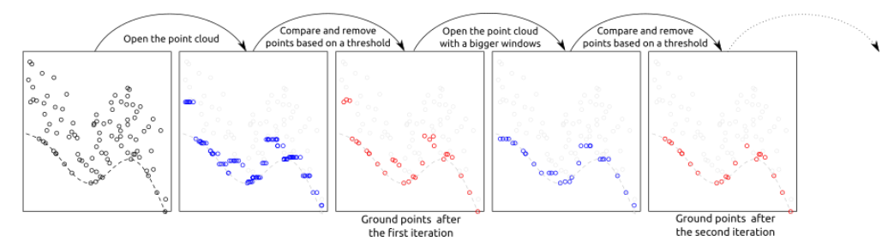

Die Funktion pmf() erfordert die Definition der folgenden Eingabeparameter: **ws** (Fenstergröße oder Folge von Fenstergrößen) und **th** (Schwellengröße oder Folge von Schwellenhöhen). Erfahrenere Benutzer können mit diesen Parametern experimentieren, um eine möglichst hohe Klassifikationsgenauigkeit zu erreichen. lidR enthält jedoch auch die Funktion util_makeZhangParam(), die die in Zhang et al. (2003) beschriebenen Standardparameterwerte enthält.

Um eine Bodenklassifizierung für unseren Datensatz durchzuführen, führen wir die folgenden Codezeilen aus:

	
	las <- classify_ground(las, algorithm = pmf(ws = 5, th = 3))
	plot(las, color = "Classification", size = 3, bg = "white") 
	
Dies dauert einen Moment. Anschließend können wir die Klassifizierung mithilfe der oben definierten Funktion plot_crossection betrachten:

	# have a look at the classification in a transect view
	# define start and end point
	p1 <- c(476715, 5429035)
	p2 <- c(476758, 5429075)
	plot_crossection(las, p1 , p2, colour_by = factor(Classification))
	
Dies ergibt den folgenden Plot

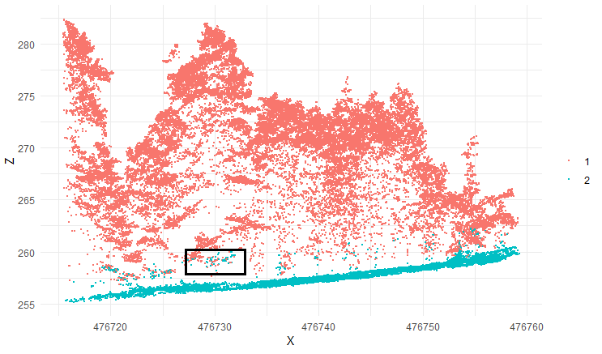

Wir sehen, dass das Ergebnis noch nicht perfekt ist, da einige als Boden klassifizierte Punkte eher Teil der Unterschicht des Waldes zu sein scheinen (einige Beispielpunkte sind im schwarzen Kasten markiert). Im Folgenden werden wir dieses Problem angehen, indem wir den PMF-Algorithmus verfeinern: Wir verwenden nicht nur eine einzelne Fenstergröße, sondern drei verschiedene Fenstergrößen und geben eine Folge von Schwellenhöhen an. Im vorliegenden Fall führen die angegebenen Einstellungen zu einem recht guten Ergebnis, aber Sie können auch andere Parameter ausprobieren. Der optimale Parametersatz kann je nach Datensatz variieren. Beispielsweise können Gebiete mit sehr unebenem Gelände andere Einstellungen erfordern als eher flache Gebiete.
 

	# adjust ground classification algorithm
	ws <- seq(3, 12, 3)
	th <- seq(0.1, 1.5, length.out = length(ws))
	las <- classify_ground(las, algorithm = pmf(ws = ws, th = th))
	plot_crossection(las, p1 , p2, colour_by = factor(Classification))

Die Ausführung dieses Codes dauert etwas länger, da mehrere Fenstergrößen und Schwellenwerte angewendet werden. Schließlich sollte dies zum folgenden Plot führen:

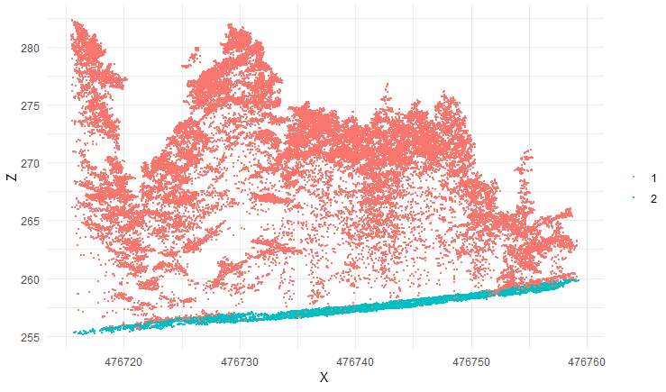

Das Ergebnis sieht recht gut aus, und fast alle Punkte, die als Boden klassifiziert wurden (grüne Farbe), erscheinen plausibel. Die Klassifizierung wird als zusätzliches Attribut in der LAS-Datei gespeichert, und wir können dieses Attribut verwenden, um die Datei zu filtern und nur die Punkte zu erhalten, die als Bodenpunkte klassifiziert wurden. Der folgende Code macht genau das und stellt anschließend die Bodenpunkte dar:
	
	# filter ground points and plot them
	gnd <- filter_ground(las)
	plot(gnd, size = 3, bg = "white") 
	
Dies führt zum folgenden Plot:

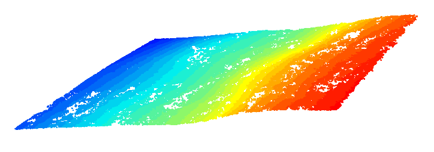

In diesem Tutorial lernen wir nur eine der in lidR verfügbaren Methoden zur Klassifizierung von Bodenpunkten kennen. Wenn Sie irgendwann mit einem eigenen Datensatz arbeiten und Probleme haben, eine hochwertige Bodenklassifizierung zu erhalten, kann es sich lohnen, die alternativen Methoden des Pakets zu untersuchen, die im lidR-Buch ausführlicher beschrieben werden (siehe Link am Anfang dieses Tutorials).

### Ein digitales Geländemodell berechnen

Die Erstellung eines digitalen Geländemodells (DTM) ist normalerweise der nächste Verarbeitungsschritt nach der Klassifizierung von Bodenpunkten. Vereinfacht gesagt kann ein DTM als „Bild“ des Bodens beschrieben werden. Methoden zur Erstellung von DTMs wurden intensiv untersucht, und für verschiedene Geländesituationen wurden zahlreiche Algorithmen vorgeschlagen. DTMs werden in der Praxis für vielfältige Zwecke eingesetzt, beispielsweise zur Bestimmung von Einzugsgebieten für Wasserrückhalt und Abfluss oder zur Identifizierung befahrbarer Wege für den Zugang zu Ressourcen. Außerdem ermöglichen sie die Normalisierung von Punktwolken, d. h. das Subtrahieren des lokalen Geländes von den Höhenwerten der Punkte, sodass Punktwolken so verarbeitet werden können, als wären sie auf einer ebenen Fläche aufgenommen worden.

Die Erstellung eines DTM beginnt mit bekannten oder abgetasteten Bodenpunkten und verwendet verschiedene räumliche Interpolationstechniken, um Bodenpunkte an nicht beprobten Positionen abzuleiten. Die Genauigkeit des DTM ist sehr wichtig, da sich Fehler auf spätere Verarbeitungsschritte wie die Schätzung der Baumhöhe fortpflanzen. Für die räumliche Interpolation von Punkten existiert eine große Bandbreite an Methoden.

Im Folgenden finden Sie den Code zum Ausführen von drei Interpolationsmethoden sowie einige Informationen zu jeder Methode.

#### Dreiecksnetz mit unregelmäßiger Struktur

Diese Methode basiert auf einem Triangular Irregular Network (TIN) der Bodenpunktdaten, um für jedes Dreieck eine bivariate Funktion abzuleiten, mit der anschließend Werte an nicht beprobten Positionen (zwischen bekannten Bodenpunkten) geschätzt werden.

Die ebenen Flächen jedes erzeugten Dreiecks werden zur Interpolation verwendet. In Verbindung mit einer Delaunay-Triangulation ist dies die einfachste Lösung, da keine Parameter erforderlich sind. Die Delaunay-Triangulation ist eindeutig und die lineare Interpolation ist parameterfrei. Nachteile der Methode sind, dass sie ein nicht glattes DTM erzeugt und das Gelände außerhalb der durch die Bodenpunkte begrenzten konvexen Hülle nicht extrapolieren kann, da außerhalb der konvexen Hülle keine Dreiecksflächen existieren. Außerdem ist die Interpolation an den Rändern schwach, weil häufig große, irrelevante Dreiecke erzeugt werden. Daher ist es wichtig, die Triangulation mit einem Puffer zu berechnen, um das DTM anschließend zuschneiden und Randartefakte entfernen zu können.

Um die Interpolation mit TIN auszuführen, führen Sie den folgenden Code aus:

	# calculate a digital terrain model from the classified
	# ground points. Three methods are available:
	
	# tin
	dtm_tin <- rasterize_terrain(gnd, res = 0.5, algorithm = tin())
	plot_dtm3d(dtm_tin, bg = "white") 

Dies führt zum folgenden Plot:

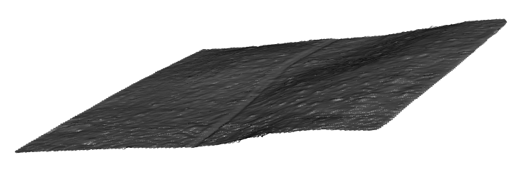

Wie Sie sehen können, sind nicht viele Details sichtbar. Das ist tatsächlich ein gutes Zeichen, da wir normalerweise davon ausgehen würden, dass ein digitales Geländemodell in einem Wald eine eher „glatte“ Oberfläche ist, weil alle LiDAR-Punkte, die zu Objekten am Boden gehören, während der Bodenklassifizierung „eliminiert“ werden. Das Einzige, was wir in der Abbildung sehen können, ist, dass eine Straße das Untersuchungsgebiet mehr oder weniger in zwei gleich große Teile teilt. Die Straße wird deutlich sichtbar, da sie eine ebene Fläche ist, die das leicht geneigte Gelände unterbricht. Schauen wir uns die beiden anderen Methoden zur Interpolation der Bodenpunkte an.

#### Inverse Distanzgewichtung

Die inverse Distanzgewichtung (IDW) ist eine der einfachsten und am leichtesten verfügbaren Methoden, die zur Erstellung von DTMs eingesetzt werden kann. Sie basiert auf der Annahme, dass der Wert an einem nicht beprobten Punkt als gewichteter Mittelwert der Werte von Punkten innerhalb einer bestimmten Abschneidedistanz d oder einer vorgegebenen Anzahl k der nächstgelegenen Nachbarn angenähert werden kann. Die Gewichte sind normalerweise umgekehrt proportional zu einer Potenz p der Entfernung zwischen dem Standort und dem Nachbarn, woraus die Berechnung eines Schätzers folgt.

Im Vergleich zu tin() ist diese Methode robuster gegenüber Randartefakten, da sie eine relevantere Nachbarschaft verwendet, erzeugt aber Geländeoberflächen, die „hügelig“ wirken und wahrscheinlich weniger realistisch sind als die mit TIN erzeugten. Bei unterschiedlichen Methoden gibt es immer Abwägungen!

Um ein digitales Geländemodell mit der Methode der inversen Distanzgewichtung zu erstellen, führen Sie Folgendes aus:
	
	# invert distance weighting
	dtm_idw <- rasterize_terrain(gnd, algorithm = knnidw(k = 10L, p = 2))
	plot_dtm3d(dtm_idw, bg = "white") 

Dies führt zum folgenden Plot:

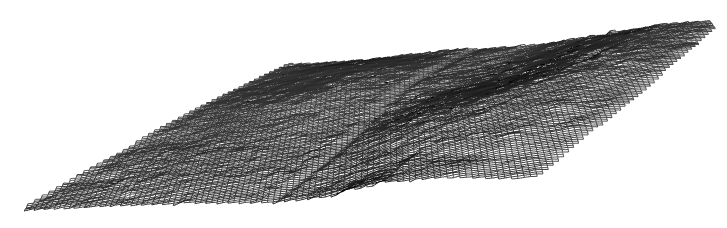

#### Kriging

Kriging ist der fortgeschrittenste Ansatz und nutzt fortgeschrittene geostatistische Interpolationsmethoden, die die Beziehungen zwischen den Rückläufen und ihren jeweiligen Abständen zueinander berücksichtigen. lidR verwendet das Paket gstat für das Kriging. Diese Methode ist sehr anspruchsvoll, schwierig zu handhaben und äußerst langsam zu berechnen, liefert aber wahrscheinlich die besten Ergebnisse mit minimalen Randartefakten.

Um ein digitales Geländemodell mit der Kriging-Methode zu erstellen, führen Sie Folgendes aus:
	
	# kriging
	dtm_kriging <- rasterize_terrain(gnd, algorithm = kriging(k = 40))
	plot_dtm3d(dtm_kriging, bg = "white") 

Dies führt zum folgenden Plot:
	
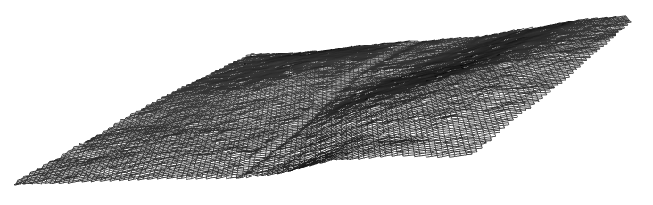

Wenn wir ein 2D-Schummerungsbild unseres Geländemodells erhalten möchten, können wir den folgenden Code ausführen.
	
	# create hillshade image from digital terrain model
	dtm_prod <- terrain(dtm_kriging, v = c("slope", "aspect"), unit = "radians")
	dtm_hillshade <- shade(slope = dtm_prod$slope, aspect = dtm_prod$aspect)
	plot(dtm_hillshade, col =gray(0:30/30), legend = FALSE)

Dies führt zum folgenden Plot:

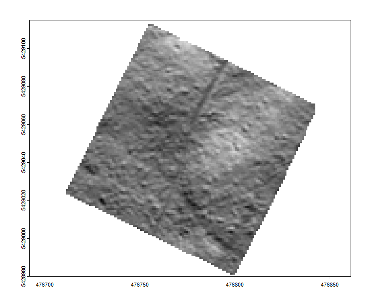

In unserem Beispieldatensatz ist dies nicht besonders spektakulär, da wir keine ausgeprägte Geländesituation haben und das Gebiet vergleichsweise klein ist. Wenn Daten aus einem größeren Gebiet verwendet werden, beispielsweise aus einem Gebirgszug, kann diese Option interessanter werden (zumindest für die Erstellung ansprechender Visualisierungen).
	

### Die LiDAR-Punktwolke normalisieren

In vielen Anwendungsbereichen sind wir daran interessiert, die Höhe von Objekten aus einer LiDAR-Punktwolke zu extrahieren. Mit Höhe meine ich dabei die Höhe der Objekte über dem Boden und nicht über dem Meeresspiegel. Beispielsweise möchten wir wissen, wie hoch bestimmte Gebäude oder Bäume sind. Mit LiDAR-Daten lässt sich diese Information für große Gebiete und mit einer sehr guten Genauigkeit von wenigen Zentimetern gewinnen. Um eine standardmäßige LiDAR-Punktwolke in eine normalisierte Punktwolke umzuwandeln, bei der der Z-Wert jedes LiDAR-Punktes die Höhe des Punktes über dem Boden angibt, können wir einfach das digitale Geländemodell von der LiDAR-Punktwolke subtrahieren.

Um dies in lidR zu erreichen, gibt es zwei verschiedene Ansätze. Ein Ansatz erfordert ein DTM. Beispielsweise können wir das mit dem Kriging-Ansatz berechnete DTM verwenden:
		
	# create a normalized height point cloud
	# by subtracting the digital terrain model from the
	# lidar point cloud
	nlas <- las - dtm_kriging
	
Anschließend können wir die resultierende Punktwolke darstellen und mit der ursprünglichen Punktwolke vergleichen, indem wir Folgendes plotten

	# plot the result
	plot(nlas, size = 4, bg = "white")
	# and compare it to the original point cloud
	plot(las, size = 4, bg = "white")
	
Dies führt zu zwei einzelnen Plots, die in der folgenden Abbildung zu einem zusammengeführt wurden:

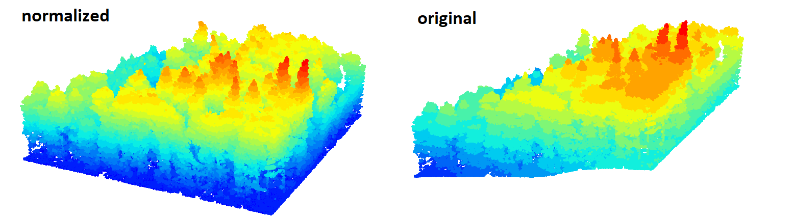

Wir können den Unterschied deutlich erkennen. Während in der ursprünglichen Punktwolke die Höhenunterschiede zwischen den Bäumen aufgrund der ebenfalls im Plot vorhandenen Hangneigung weniger deutlich sind, werden die Höhenunterschiede in der normalisierten Punktwolke klar sichtbar, da alle Punkte auf einem „flachen“ Boden stehen.

Eine Folge der Normalisierung der Punktwolke sollte sein, dass alle als Bodenpunkte klassifizierten LiDAR-Punkte einen Z-Wert von 0 m haben. Mit dem folgenden Plot können wir prüfen, ob dies zutrifft:
	
	# this should lead to a situation where all ground points
	# have a value of 0.0 m. We can check this with the following 
	# command. Be aware that this a nested function. That is, the
	# hist() command is used to create a histogram and the filter_ground()
	# command is used to only show values for point classified as
	# ground in the codeparts before and the $Z is used to only
	# show height values. The breaks command decides how fine the
	# individual bars of the histogram are - this could also be left
	# out. The dev.off() command is used to close any plot that is still
	# open.
	dev.off()
	hist(filter_ground(nlas)$Z, breaks = seq(-0.6, 0.6, 0.01), main = "", xlab = "Elevation")
	
Dies führt zum folgenden Plot:

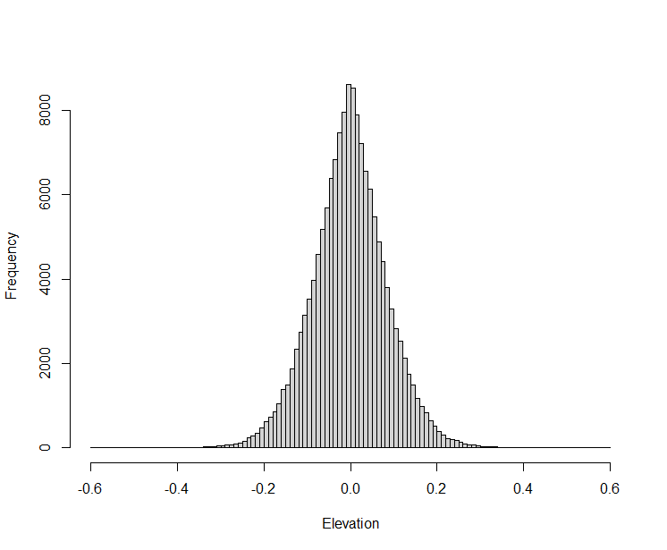

Wir sehen, dass die Annahme mehr oder weniger zutrifft, aber wir sehen auch, dass die Bodenpunkte nicht alle exakt bei 0 m liegen, sondern zwischen ungefähr -0,5 und 0,5 m schwanken. Dies hängt damit zusammen, dass wir ein interpoliertes DTM mit einer bestimmten Gittergröße verwendet haben. Innerhalb einer einzelnen Rasterzelle des DTM ist der Höhenwert an jeder Position der Rasterzelle exakt gleich. Daher können einige Bodenpunkte unter oder über diesem Wert liegen.

Wenn alle Bodenpunkte einen Wert von null haben sollen, bietet lidR eine Funktion zur Normalisierung der Punktwolke anhand der Bodenpunkte ohne gitterbasierte Interpolation. Für die Nicht-Bodenpunkte findet weiterhin eine gewisse Interpolation statt, aber alle Bodenpunkte erhalten einen Wert von null. Diese Methode kann mit folgendem Befehl ausgeführt werden:

	# create a normalized height point cloud
	# by subtracting the height of the lowest point nearby
	# this is similar to the just described step, but it assumes 
	# a continuous DTM without a pixel size
	nlas <- normalize_height(las, knnidw())
	# the histogram plot now shows that all ground points are at zero.
	hist(filter_ground(nlas)$Z, breaks = seq(-0.6, 0.6, 0.01), main = "", xlab = "Elevation")

Der zugehörige Plot bestätigt, dass nun tatsächlich alle Bodenpunkte einen Z-Wert von 0 haben.

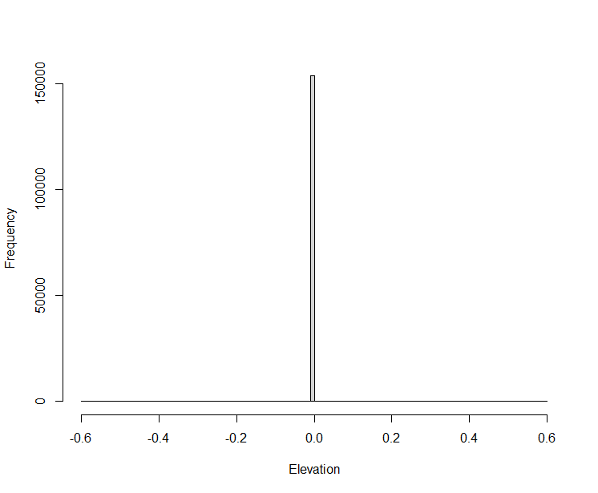	

### Digitale Oberflächenmodelle und Kronenhöhenmodelle berechnen

Digitale Oberflächenmodelle (DSM) und Kronenhöhenmodelle (CHM) sind Rasterebenen, die mehr oder weniger die höchste Höhe der ALS-Rückläufe darstellen. Bei einer normalisierten Punktwolke stellt die daraus abgeleitete Oberfläche die Kronenhöhe (für bewachsene Flächen) dar und wird als CHM bezeichnet. Wenn die ursprüngliche (nicht normalisierte) Punktwolke mit absoluten Höhen verwendet wird, stellt die abgeleitete Ebene die Höhe der Kronenspitze über dem Meeresspiegel dar und wird als DSM bezeichnet. Beide Oberflächenmodelle werden mit denselben Algorithmen abgeleitet; der einzige Unterschied besteht in den Höhenwerten der Punktwolke.

Es gibt verschiedene Methoden zur Erstellung von DSMs und CHMs. Im einfachsten Fall kann ein Gitter mit einer vom Benutzer festgelegten Pixelgröße erstellt und die Höhe des höchsten Punktes jeder Rasterzelle zugewiesen werden. Dies wird als Point-to-Raster bezeichnet.

Point-to-Raster-Algorithmen sind konzeptionell einfach: Es wird ein Gitter mit einer vom Benutzer festgelegten Auflösung erstellt und jedem Pixel die Höhe des höchsten Punktes zugewiesen. Algorithmische Implementierungen sind rechnerisch einfach und extrem schnell. Im ersten Beispiel setzen wir die Pixelgröße auf 1 und den entsprechenden Algorithmus auf p2r():
	
	# point-to-raster method
	chm <- rasterize_canopy(las, res = 0.5, algorithm = p2r())
	col <- height.colors(25)
	plot(chm, col = col)

Dies führt zum folgenden Plot:
	
	

Wie wir sehen können, zeigen die dargestellten Höhenwerte weiterhin Höhen über dem Meeresspiegel. Obwohl wir im Untersuchungsgebiet Höhenunterschiede von mehr als 60 m sehen, hängen daher nicht alle diese Höhenunterschiede mit der Höhe der Bäume zusammen. Dies wäre also ein Beispiel für ein „digital elevation model“ (DSM), ein Raster, das die Höhe über dem Meeresspiegel des Bodens + der Objekte auf dem Boden an jeder räumlichen Position zeigt. Wenn wir nur die Höhe der Objekte sehen möchten, benötigen wir ein „normalized digital elevation model“ (nDSM) oder im Fall von Wäldern ein sogenanntes „canopy height model“ (CHM). Dieses wird entweder durch Subtraktion eines DTM von einem DSM desselben Gebiets erzeugt oder indem direkt derselbe Algorithmus wie zur Berechnung des DSM auf die bereits normalisierte Punktwolke angewendet wird:

 	# point-to-raster method
	chm <- rasterize_canopy(nlas, res = 0.5, algorithm = p2r())
	col <- height.colors(25)
	plot(chm, col = col)

Dies führt zum folgenden Plot:

	

In einigen Fällen hat die Point-to-Raster-Methode Nachteile. Wenn Sie beispielsweise einen LiDAR-Datensatz mit vergleichsweise wenigen Rückläufen haben, können in Ihrem Höhenmodell Datenlücken entstehen. Ein alternativer Ansatz zur Berechnung von DSMs und nDSMs ist der TIN-Ansatz, den wir bereits zur Berechnung von DTMs verwendet haben.

Der Triangulationsalgorithmus erstellt zunächst ein Triangular Irregular Network (TIN), das nur die ersten Rückläufe verwendet, und führt anschließend innerhalb jedes Dreiecks eine Interpolation durch, um einen Höhenwert für jedes Pixel eines Rasters zu berechnen. In seiner einfachsten Form besteht diese Methode aus einer strikten 2-D-Triangulation der ersten Rückläufe. Obwohl sie komplexer als der Point-to-Raster-Algorithmus ist, besteht ein Vorteil des Triangulationsansatzes darin, dass er parameterfrei ist und unabhängig von der Auflösung des Ausgaberasters keine leeren Pixel erzeugt (d. h. die gesamte Fläche wird interpoliert).

Wie Point-to-Raster kann die TIN-Methode jedoch zu Lücken und anderem Rauschen in der Oberfläche führen – sogenannten „pits“ –, die auf erste Rückläufe zurückzuführen sind, die tief in die Baumkrone eingedrungen sind. Pits können die Segmentierung einzelner Bäume erschweren und die Textur der Baumkrone auf unrealistische Weise verändern. Um dieses Problem zu vermeiden, wird das CHM bei der Nachbearbeitung häufig geglättet, um eine realistischere Oberfläche mit weniger Pits und weniger Rauschen zu erzeugen. Um ein Oberflächenmodell mittels Triangulation zu erstellen, verwenden wir algorithm = dsmtin().

	# tin method
	chm <- rasterize_canopy(las, res = 0.5, algorithm = dsmtin())
	plot(chm, col = col)

Dies führt zum folgenden Plot:

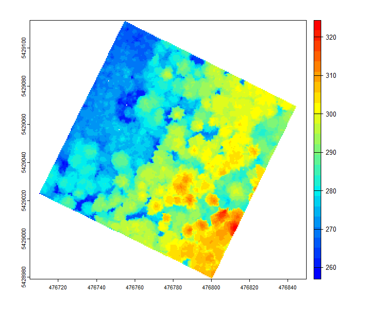		

In unserem Datensatz sind die Unterschiede recht gering.

Wir nähern uns nun dem Ende dieses Tutorials, und bisher haben Sie die wichtigsten grundlegenden Verarbeitungsschritte für LiDAR-/Laserscanning-Daten kennengelernt. Zum Abschluss werfen wir einen kurzen Blick auf zwei zusätzliche Schritte, die den Ausgangspunkt für die meisten LiDAR-Analysen in der Vegetations- und Waldanalyse darstellen.

### Erkennung einzelner Bäume

Typischerweise arbeiten LiDAR-Analysen in Wäldern entweder auf Ebene einzelner Bäume oder im sogenannten flächenbasierten Ansatz. Bei Letzterem ist die grundlegende Einheit der Analyse eine Zelle mit einer vom Benutzer festgelegten festen Größe (z. B. 20 x 20 m). Beim einzelbaumbezogenen Ansatz ist die grundlegende Einheit der Analyse ein einzelner Baum. Die automatische Abgrenzung von Bäumen aus einer LiDAR-Punktwolke ist ein eigenes Forschungsgebiet, und wir werden in diesem Tutorial nicht näher darauf eingehen. Das Paket lidR bietet jedoch einen Standardalgorithmus zur Identifizierung von Baumspitzen aus einer LiDAR-Punktwolke, der im Folgenden kurz erläutert wird.

Baumspitzen können erkannt werden, indem ein Local Maximum Filter (LMF) auf den geladenen Datensatz angewendet wird. Der LMF in lidR ist punktwolkenbasiert, d. h. er findet die Baumspitzen direkt aus der Punktwolke, ohne ein Raster zu verwenden. Die Verarbeitung ist jedoch tatsächlich sehr ähnlich. Für einen gegebenen Punkt analysiert der Algorithmus benachbarte Punkte und prüft, ob der verarbeitete Punkt der höchste ist. Dieser Algorithmus kann mit der Funktion
Local Maximum Filter – lmf() angewendet werden.

Der LMF kann mit Fenstern konstanter Größe angewendet werden. Im folgenden Code bedeutet eine Fenstergröße von ws = 5 Metern, dass der Algorithmus für einen gegebenen Punkt die Nachbarpunkte innerhalb eines Kreises mit einem Radius von 2,5 m betrachtet, um festzustellen, ob der Punkt lokal der höchste ist. Obwohl der Algorithmus kein CHM benötigt, um zu funktionieren, haben wir uns für die Darstellung der Ergebnisse auf einem CHM entschieden, um die Visualisierung zu verbessern.
	
	# detect tree tops with fixed window size of 5
	ttops <- locate_trees(nlas, lmf(ws = 5))
	
	# have a look at results
	chm <- rasterize_canopy(nlas, res = 0.5, algorithm = p2r())
	plot(chm, col = height.colors(50))
	plot(sf::st_geometry(ttops), add = TRUE, pch = 3)

Dies benötigt etwas Zeit für die Verarbeitung und führt anschließend zum folgenden Plot:

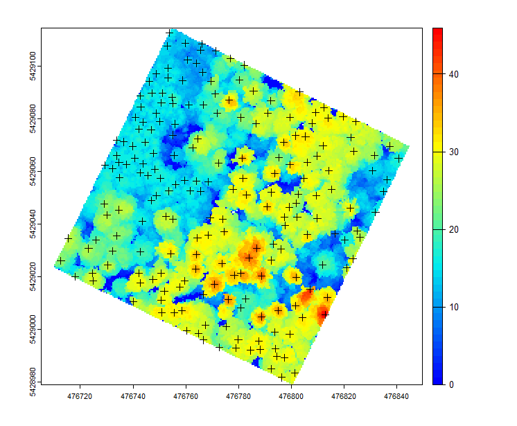	

Wir können uns das Ergebnis auch in 3D ansehen:
	
	# have a look at results in 3d
	x <- plot(nlas, bg = "white", size = 4)
	add_treetops3d(x, ttops)
	
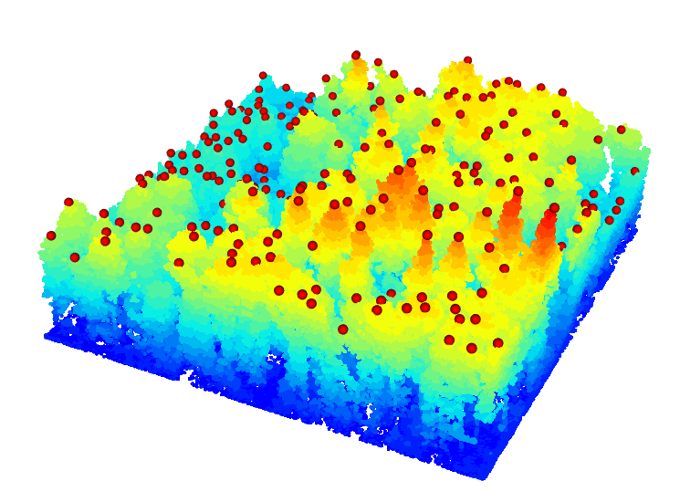		

Wenn wir mit den Ergebnissen dieses vergleichsweise einfachen Ansatzes nicht zufrieden sind, können wir den Algorithmus verfeinern, indem wir das Suchfenster abhängig von der Kronenhöhe anpassen und dabei annehmen, dass weniger hohe Bäume auch kleinere Kronen haben. Dies kann erreicht werden, indem wir dem Algorithmus eine Funktion übergeben, die die Beziehung zwischen Baumhöhe und Fenstergröße beschreibt, sowie eine Folge von Höhen, für die unterschiedliche Fenstergrößen verwendet werden:

	# adapt window size with height
	f <- function(x) {x * 0.1 + 3}
	heights <- seq(0,40,10)
	ws <- f(heights)
	plot(heights, ws, type = "l", ylim = c(0,6))
	
Dies führt zu leicht unterschiedlichen Ergebnissen:

	ttops <- locate_trees(nlas, lmf(f))
	plot(chm, col = height.colors(50))
	plot(sf::st_geometry(ttops), add = TRUE, pch = 3)
	
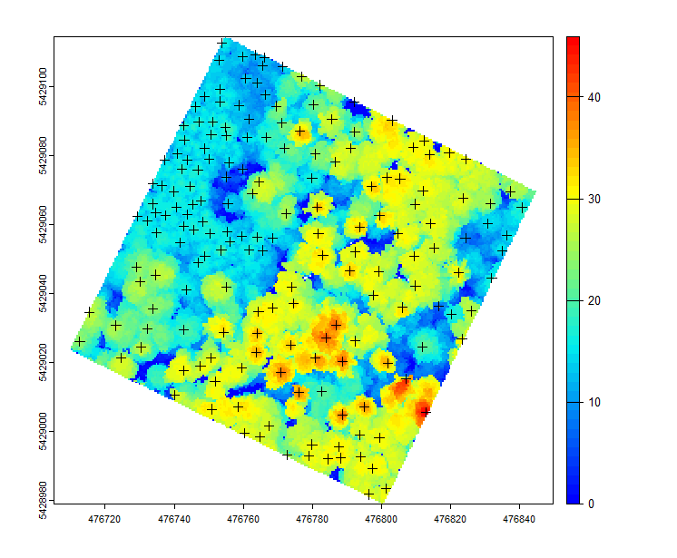		

Die Identifizierung des optimalen Parameters ist keine einfache Aufgabe und kann eine Art Referenzdaten erfordern, die beispielsweise durch visuelle Interpretation eines CHM oder durch die Identifizierung von Baumstammpositionen im Gelände gewonnen werden können. Letzteres ist jedoch häufig ebenfalls fehleranfällig, da die genaue Position eines Baumes im Gelände zu bestimmen keine triviale Aufgabe ist. Hinzu kommt, dass die Stammposition am Boden nicht unbedingt direkt mit der Spitze der Krone zusammenhängt, da viele Bäume nicht exakt vertikal wachsen.

Die Erkennung von Baumspitzen ist normalerweise nur der erste Schritt bei der Abgrenzung/Segmentierung einzelner Bäume, da sie noch nicht ermöglicht, die Kronenfläche eines Baumes zu identifizieren. lidR stellt auch für diese Aufgabe Funktionen bereit, aber wir werden dies hier anhand unseres Beispieldatensatzes nicht demonstrieren. Unter anderem, weil unserem Datensatz ein Koordinatenreferenzsystem fehlt (das zunächst zugewiesen werden müsste) und die Funktionen nicht unmittelbar funktionieren werden. Sie können diese Funktionen jedoch gerne auch mit den Beispieldatensätzen ausprobieren, die mit lidR geliefert werden. Die entsprechenden Daten und Anweisungen finden Sie im lidR-Buch (siehe Link am Anfang des Tutorials).

	
### Punktwolkenmetriken berechnen

Als letzten Schritt lernen wir zwei wichtige Funktionen des Pakets lidR zur Berechnung von Punktwolkenmetriken kennen. Punktwolkenmetriken sind ein wesentlicher Bestandteil des oben kurz erwähnten flächenbasierten Ansatzes. Die Idee besteht darin, ein regelmäßiges Gitter aus quadratischen oder sechseckigen Polygonen über die Punktwolke zu legen. Anschließend werden in jeder Rasterzelle/jedem Polygon einige Metriken für die Punkte berechnet, die innerhalb der Rasterzelle/des Polygons liegen.

Die Standardabweichung der Punkthöhen innerhalb einer einzelnen Baumkrone ist ein Beispiel für eine auf Baumebene berechnete Metrik. Die durchschnittliche Entfernung zwischen einem Punkt und seinen k-nächsten Nachbarn ist eine auf Punktebene berechnete Metrik. Es lassen sich auch komplexere Metriken vorstellen, beispielsweise die durchschnittliche Entfernung zwischen ersten und letzten Rückläufen innerhalb eines Pixels oder innerhalb eines Baumes. Letztendlich dienen sie unabhängig von der Skala, auf der die Metriken berechnet werden, als Näherungswerte für Merkmale der Waldinventur oder können als unabhängige Variablen in Vorhersagemodellen verwendet werden.

Die Standardmetriken des Pakets lidR enthalten bereits eine große Anzahl gängiger und häufig verwendeter Variablen und können mit dem folgenden Code entweder für quadratische Rasterzellen berechnet werden:
	
	a <- pixel_metrics(nlas, func = .stdmetrics, res = 2.5)

oder für ein Hexagon-Gitter:

	b <- hexagon_metrics(nlas, func = .stdmetrics, area = 20)
	
Die Namen der erhaltenen Metriken können durch Ausführen von Folgendem ermittelt werden:

	a@ptr$names

Dies führt zur folgenden Ausgabe:

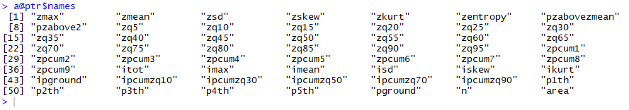	

Wenn wir sehen möchten, wie eine 2D-Darstellung einer der Metriken in einem der Datensätze aussieht, können wir einen der Variablennamen auswählen und Folgendes ausführen:
	
	plot(a["zq80"], pal = heat.colors, axes = TRUE, key.pos = NULL, reset = FALSE)

Dies führt zu:

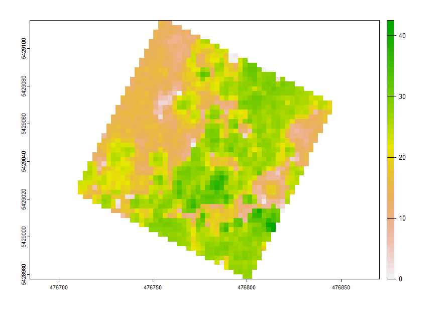	

or:

	plot(b["zq80"], pal = heat.colors, axes = TRUE, key.pos = NULL, reset = FALSE)

Dies führt zu:

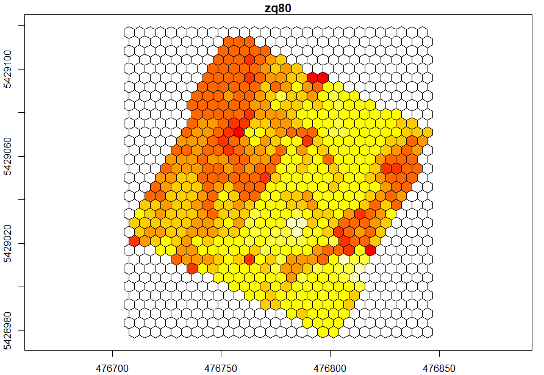	

Diese Metriken können beispielsweise mit im Gelände erhobenen Waldmerkmalen in Beziehung gesetzt werden. Regressionsmodelle können trainiert werden, um zunächst die im Gelände gemessenen Daten mit den Metriken in Beziehung zu setzen und anschließend mit dem trainierten Modell das gesamte Gebiet vorherzusagen, für das Laserscanning-Daten erhoben wurden.

Dies war der letzte Schritt dieses Tutorials, und Sie sind nun bestens vorbereitet, mit den Punktwolken zu arbeiten, die wir während der Feldwoche dieses Kurses erfassen werden.
